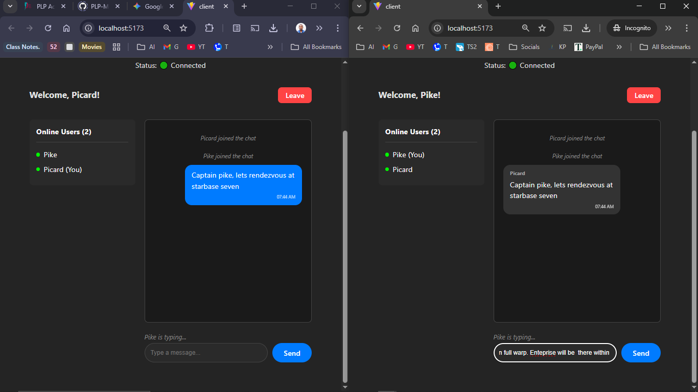

# Real-Time Chat Application 🚀

A full-stack real-time chat application built with **React**, **Node.js**, and **Socket.io**. This application allows multiple users to join a global chat room, see who is online, and send private messages with real-time notifications.

## ✨ Features

- **Real-Time Messaging:** Instant bidirectional communication using Socket.io.
- **User Authentication:** Simple username-based login system.
- **Online User List:** See who is currently connected in real-time.
- **Typing Indicators:** Visual cues ("User is typing...") when someone is writing a message.
- **Private Messaging:** Click on any user to start a private, secure conversation.
- **Real-Time Notifications:** Toast pop-ups for incoming messages when you are busy.
- **Responsive Design:** Dark mode interface built with CSS.

## 🛠️ Tech Stack

- **Frontend:** React (Vite), Socket.io Client, React-Toastify
- **Backend:** Node.js, Express, Socket.io Server
- **Styling:** CSS3 (Dark Theme)

## 🚀 Setup Instructions

### Prerequisites
- Node.js (v18 or higher)
- npm (Node Package Manager)

### 1. Clone the Repository
```bash
git clone <your-repo-url>
cd <your-project-folder>
```
### 2. Install Dependencies
```bash
npm install
```
### 3. Run the Application
```bash
npm run dev
```
### 4. Open in Browser
Visit `http://localhost:5173` in your browser to start chatting!


.png>)
.png>)
.png>)
.png>)
.png>)
.png>)
